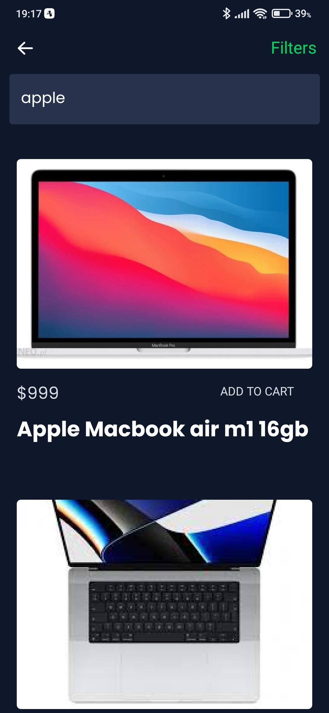
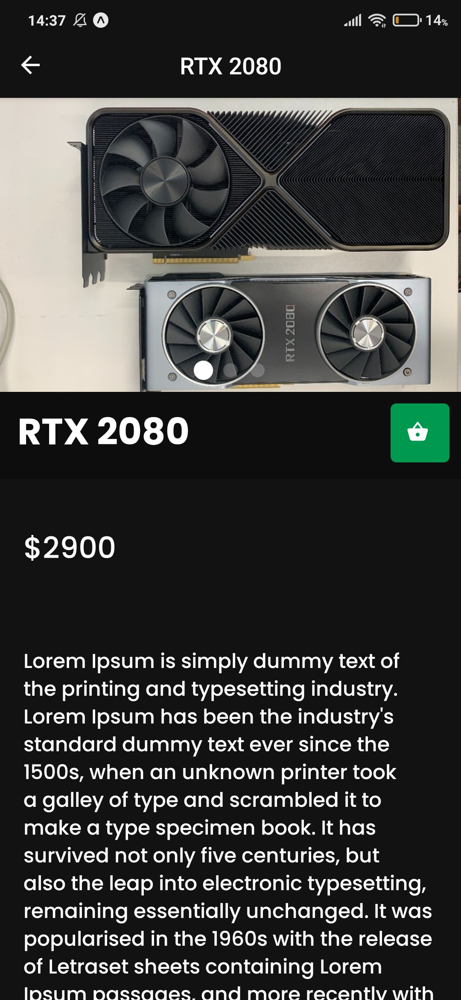

# Mobile Shop

Mobile shop app created using Expo React-native.

## Used Technologies:

- **React-Native**
- **Typescript**
- **expo** with **expo-notifications**
- **React Navigation**
- **React-Native-Reanimated** for animations
- **Formik** with **yup** for form validation
- **React-Native Stripe** [Card payment only for now]
- **Apollo client** graphQL queries
- **@reduxjs/toolkit** for state managment

 

## **Application Screens**:

 

### **Home**

Home screen is responsible for main navigation and displaying products.
Products are separaded into couple of categories:   `Daily sale, Best Rated, Recent Searches, Auctions and All products`. Every product has `Add to cart` button and price beside

### **Checkout**

Checkout screen has couple on inputs with user credentials to finish the purchase and _stripe_ component for handling card payment and validation.

### **Cart**

In cart screen user can either remove or add more products.

### **User**

User screen allows to take couple of actions like navigate to other screens, sign out, or change application theme.

### **Landing**

Landing screen is first place where not authenticated users will land after running the app. From there user can go to sign in or register.

### **Account settings**

Account settings screen is responsible for managing user credentials like name, surname etc.

### **Search**

Search screen contains search input with some basic filters and result of the query.

### **My reviews**

Screen that contains all user reviews in one place

### **Purchase history**

Sorted list of purchases, with possibility to inspect them or purchase details

### **Create review**

### **Product**

Product's details screen with image carusel, action buttons like follow or add to cart, product's description with matching tags and other important info

### **Login and Register**

### **Product reviews**

### **Search results**

### **Watchlist**

### **Auction**

### **Upload**
