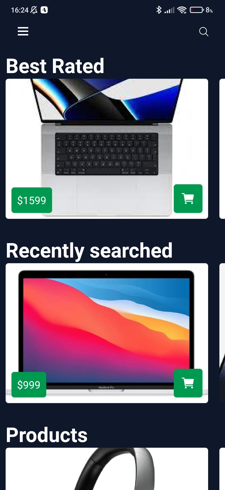
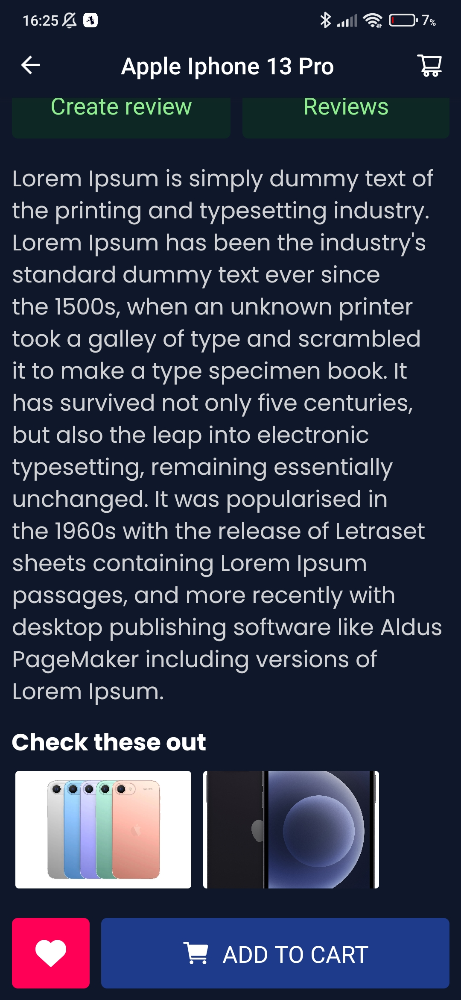
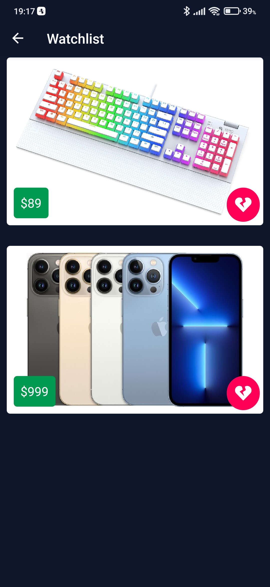

# Mobile Shop

Mobile shop app created using Expo React-native.

## Used Technologies:

- **React-Native**
- **Typescript**
- **Expo** with **expo-notifications**
- **React Navigation**
- **React-Native-Reanimated** for animations
- **Formik** with **yup** for form validation
- **React-Native Stripe** [Card payment only for now]
- **Apollo client** graphQL queries
- **@reduxjs/toolkit** for state managment

 

## **Application Screens**:

 

### **Home**

    
    

### **Checkout**

### **Cart**

### **User details**

### **Landing**

### **Account settings**

### **Search**

### **My reviews**

### **Purchase history**

### **Create review**

### **Product**

    
    

### **Login and Register**

### **Product reviews**

### **Search results**

    
    

### **Watchlist**

    
   

### **Auction**

    
    

### **Upload**
